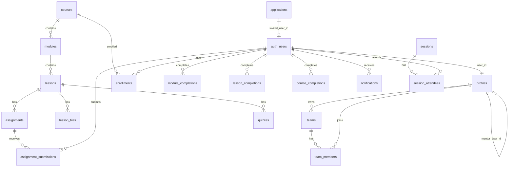

# Ember Network — Supabase database architecture

Reverse-engineered from `supabase/migrations/`, `server/`, `api/`, and `src/services/`.  
**Project ref:** `lfdttxwvjgypljuhgjeu`

## Architecture pattern

| Layer | Role |
|--------|------|
| **auth.users** | Supabase Auth (email/password, invites, recovery) |
| **public.profiles** | App user record (`user_id` = PK → `auth.users.id`) |
| **Express API** | Primary write path for admin/mentor; uses **service role** (bypasses RLS) + field whitelists |
| **PostgREST (anon key)** | Member reads/writes where RLS allows (enrollments, notifications, teams, etc.) |

Do **not** use a separate `public.users` table — profiles are keyed by `user_id`.

## Roles (`profiles.role`)

| Role | Access |
|------|--------|
| `student` | Member area, courses, enrollments, own submissions |
| `mentor` | `/mentor` workspace, own courses, mentees via `mentor_user_id`, review submissions |
| `staff` | Admin CMS, courses, members (no super-only settings) |
| `admin` | Full admin |
| `super_admin` | Role/status changes (DB trigger + UI) |

## Entity relationship diagram

## Tables (by domain)

### Identity & membership

| Table | Purpose |
|-------|---------|
| `profiles` | Name, email, role, status, mentor link, avatar, bio, goals |
| `teams` | Named workspaces |
| `team_members` | `(team_id, user_id)` + role owner/admin/member |

### Learning content

| Table | Purpose |
|-------|---------|
| `courses` | Catalog; `published`, `created_by` (mentor owner) |
| `modules` | Ordered sections per course |
| `lessons` | Content JSON; `status` draft/published |
| `lesson_files` | Storage-backed attachments |
| `assignments` | Lesson practice items |
| `assignment_submissions` | Student work + mentor grade/approve |
| `quizzes` | MC questions (`options_json`) |
| `quiz_attempts` | Scores per user/lesson |

### Progress & certificates

| Table | Purpose |
|-------|---------|
| `enrollments` | User ↔ course |
| `module_completions` | Admin-marked module done (`marked_by`) |
| `lesson_completions` | Admin-marked lesson done |
| `course_completions` | Admin-marked course done |
| `user_course_state` | Last active module |
| `certificates` | Issued per user/course |
| `course_progress` | **VIEW** — % from modules completed |
| `lesson_progress` | **VIEW** — alias over lesson_completions |

### Mentorship & comms

| Table | Purpose |
|-------|---------|
| `mentorship_milestones` | Per-student milestones |
| `announcements` | Broadcast; triggers `notifications` |
| `notifications` | In-app inbox |
| `sessions` | Scheduled events |
| `session_attendees` | Invite/confirm per user |

### Intake & CMS

| Table | Purpose |
|-------|---------|
| `applications` | Public apply form → staff approve/reject |
| `contact_submissions` | Contact form |
| `site_content` | JSON blobs (e.g. `home.hero.v1`) |
| `cms_content` | Page/section rows |
| `media_assets` | Media library metadata |
| `resources` | Public downloads page |
| `activity_logs` | Audit trail (staff read) |

## Storage buckets

| Bucket | Public | Use |
|--------|--------|-----|
| `public` | yes | Lesson files, assignments, general CMS uploads |
| `avatars` | no | Profile images (`{user_id}/…`) |
| `course-media` | yes | Course thumbnails/media |
| `resources` | yes | Resource PDFs/assets |

## Auth triggers

- `on_auth_user_created` → `handle_new_user()` inserts `profiles` row.
- `on_team_created` → adds owner to `team_members`.
- `announcements_notify` → fan-out `notifications` on publish.
- `profiles_guard_sensitive_columns` → blocks role escalation via PostgREST.
- `stamp_application_review` → sets `reviewed_by` when staff updates via client (service role sets explicitly in API).

## Migration order

See `supabase/migrations/README.md` — apply with `supabase db push`.

Latest additive migration: `20260321130113_schema_completeness.sql` (grants, mentor RLS, storage, realtime).

## Bootstrap (not SQL seed)

Use npm scripts (see root `README.md`):

- `bootstrap:cms`, `bootstrap:admin`, `bootstrap:mentor`, `bootstrap:sample`, `bootstrap:resources`

## Frontend ↔ schema map

| Client query | Table / view |
|--------------|----------------|
| `getMyProfile()` | API → `profiles` |
| `listCourses()` | API → `courses` |
| `listMyEnrollments()` | `enrollments` |
| `listMyCourseProgress()` | `course_progress` view |
| `listMyNotifications()` | `notifications` |
| `listMyMilestones()` | `mentorship_milestones` |
| `listMyUpcomingSessions()` | `session_attendees` + `sessions` |
| `listResources()` | API public → `resources` |
| Mentor APIs | Service role → mentees, submissions, courses |

## Security model

- **RLS enabled** on all user tables.
- **Members** read/write own rows; cannot mark completions (staff API only).
- **Mentors** manage own courses + mentee submissions (RLS + `/api/mentor/*`).
- **Staff** `is_staff()` / `is_admin()` helpers for CMS and admin.
- **Service role** used server-side only — never in the browser.
